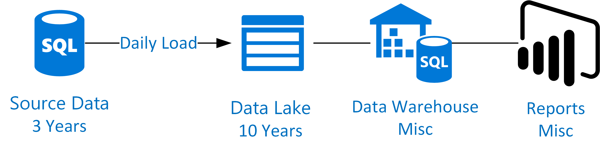
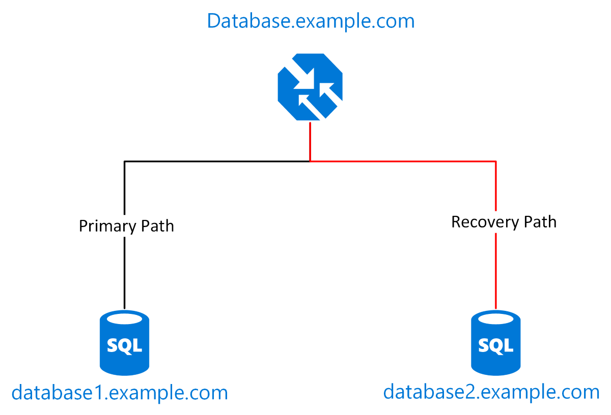
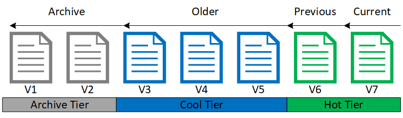

# Backup and DR for Data Platforms
**Dave Lusty**

# Contents

* [Introduction](#Introduction)
  * [The Data Platform](#TheDataPlatform)
* [Data Protection Concepts](#DataProtectionConcepts)
  * [SLA](#SLA)
  * [Backup and Restore](#IntroductionBackupAndRestore)
  * [Disaster Recovery](#IntroductionDisasterRecovery)
  * [Archive](#IntroductionArchive)
* [Design Considerations](#DesignConsiderations)
  * [Cloud Compute](#CloudCompute)
  * [Cost Time Tradeoff](#costTimeTradeoff)
  * [Decoupled Infrastructure](#CloudComputeDecoupled)
  * [Regional Service Availability](#IntroductionRegionalServiceAvailability)
* [General Requirements](#GeneralRequirements)
  * [Systems Of Record](#SystemsOfRecord)
    * [Backup](#SystemsOfRecordBackup)
    * [Disaster Recovery](#SystemsOfRecordDisasterRecovery)
  * [Ingest](#Ingest)
    * [Backup](#IngestBackup)
    * [Disaster Recovery](#IngestDisasterRecovery)
  * [Store](#Store)
    * [Raw](#StoreRaw)
    * [Enriched](#StoreEnriched)
    * [Curated](#StoreCurated)
    * [Presentation](#StorePresentation)
  * [Prep and Train](#PrepAndTrain)
    * [Scripts](PrepAndTrainScripts)
    * [Modeled Data](PrepAndTrainModeledData)
    * [Infrastructure Configurations](PrepAndTrainInfrastructureConfigurations)
  * [Model](#Model)
  * [Serve](#Serve)
    * [Cache](#ServeCache)
    * [Presentation](#ServePresentation)
* [SQL](#SQL)
  * [SQL Managed Instance](#SQLSQLManagedInstance)
  * [SQL Server](#SQLSQLServer)
  * [Azure SQL Database](#SQLAzureSQLDatabase)
* [Data Factory](#DataFactory)
  * [Integration Runtime](#DataFactoryIntegrationRuntime)
  * [Pipelines](#DataFactoryPipelines)
* [Data Lake](#DataLake)
  * [Storage Account (blob)](#DataLakeStorageAccount)
    * [Blob Lifecycle Management](#DataLakeStorageAccountBlobLifecycleManagement)
  * [Azure Data Lake Store Gen 2](#DataLakeStorageAccountAzureDataLakeStoreGen2)
  * [Azure Data Lake Store Gen 1](#DataLakeStorageAccountAzureDataLakeStoreGen1)
* [HDInsight](#HDInsight)
* [Azure Databricks](#AzureDatabricks)
* [SQL Data Warehouse](#SQLDataWarehouse)
* [Azure Analysis Services](#AzureAnalysisServices)
* [Power BI](#PowerBI)

# Introduction

This guide aims to show effective ways of backing up and recovering a cloud data platform, as well as how to recover in a regional outage or disaster recovery situation. Data loss prevention and business continuity can be extremely important once a data platform becomes line of business. Implementing this in a cost effective manner which will allow recovery with an impact appropriate to your business can be challenging. This guide will familiarise you with the concepts and trade offs and prepare you to design an effective solution.

## The Data Platform

In this instance cloud data platform refers to cloud data warehousing using data lake and Data Factory such as in the image below. While this is a specific solution, the concepts will translate well to other scenarios including realtime data processing scenarios using a data lake architecture.

# Data Protection Concepts

## SLA

A good SLA is the start of any recovery solution. Ideally the SLA should be known prior to designing an availability solution. At one end of the scale would be a solution where no recovery is needed since re-implementation could be fast enough for the business use. At the other end of the scale, a sales organisation may depend on reporting and analytics to the point that money and revenue will be lost if the data platform is unavailable for any length of time.

**RPO**
The Recovery Point Objective. This is the amount of data loss you're prepared to accept. In large data solutions it is likely that a day of data loss is acceptable since it can take time to replicate data to another location. We would then re-process the lost data to catch up on the DR site. For other systems it may be that no data loss is acceptable and so syncronous replication is necessary which may add cost and complexity.
Whilst the data to be recovered from the primary site may allow for a more relaxed RPO, you should bear in mind that the actual objective for the recovered system might be to provide a more up to date system than the one being recovered. This is because reporting and analytics are constantly moving targets. Recovering a reporting solution exactly as it was 6 hours ago is not of any use when the report itself has a refresh of 4 hours. As such, it might be necessary to plan for processing some new data at the same time that older data is being recovered from backup or DR systems.

Flexibility may be used here to reduce costs. If the _really_ important information is the last four hours, then your recovery may set one RPO/RTO for that information and a different one for historic data. This may be sufficient to show the consumers of the information what they need in the short term before getting everything back later on.

**RTO**
The Recovery Time Objective is the amount of time allowed before recovery is complete. For data platforms this will vary depending on usage. Longer RTOs are preferable since they allow reduction of cost and complexity.

For the data platform, RTO and RPO may be complicated due to the pipeline nature of the data flows. If a Power BI report must have up to date data within 4 hours, then all systems bringing that data into the report must also be recoverable within that time, and complete any necessary processing to catch up data processing. This may not be achievable so be careful when writing SLAs for the various components in your solution.

In cloud solutions, disaster recovery is very different to on-premises. Here, considerations such as speed of deployment and cost may affect the decision as to how you will recover. More than ever, the RPO and RTO requirements must be realistic and specific to the scenario. Where data is available in a replicated storage account, the difference between live continuity using clustering, booting a cold system, and building a new system from scratch might be around 30 minutes but many thousands of dollars in consumption. It is imperative, therefore to determine whether that 30 minute windows while a database server deploys are worth the cost of leaving such a system running. In data platforms especially it is likely the workload is batch and would need to re-start a processing job anyway. Additionally, the likelihood of a regional outage from a global cloud provider is lower than that of on-premises solutions. The security and change controls alone make accidental outages less likely while advanced facility design and provisioning ensure that failure is less likely and may be mitigated rather than allowing a failure. Design of the platform ensures that many components within region are resilient or can be swapped out more quickly than a full DR failover. Again, the RTO comes into play as we need to balance the speed and complexity of a failover with the speed and efficiency of the cloud provider recovering. Data should always be made available in a secondary region, or saved to a location off-cloud. In the case of data platforms, much of the data is build from systems of record anyway and so can potentially be recreated rather than restored. Again, cost will come into the equation as you need to determine whether it’s cheaper to recreate and reprocess data or to recover it after storing backup copies.

## Backup and Restore

Backup involves creating recovery points which can be used to restore data to a previous version should anything go wrong. Backup does not require data to be copied elsewhere or taken off site, but this is often done. Where data is copied to a secondary location, this is considered a disaster recovery solution for the backup system, not part of the backup system itself.
Cloud platform backup and recovery is often a big change to traditional off-site tape backup. Firstly, we need to be clear of the purposes of the backup. The traditional tape solution was used for everything since it was the only avenue to any recovery. As such it included recovering data, recovering systems, and recovering during a DR scenario. In the cloud, the connected nature of the platform and the on-demand provisioning change this viewpoint. Since we are now able to provision on demand it is generally preferable to store the deployment configuration rather than a full system image. Since we have multiple, well connected regions it is preferable to have a cold, warm, or hot standby site rather than recover from scratch in a disaster. As such, backup may be seen as primarily a way to recover data following corruption or accidental modification. Scenarios to consider for backup are:
* Accidental data modification
* Data corruption
* Accidental configuration change
Retention of backups as a form of archival should be avoided unless specifically called for in regulation. As a rule, backup copies do not aide compliance and in cases such as GDPR will often harm compliance. Archival of data will not be covered in this document and is considered a separate subject.

## Disaster Recovery

Disaster recovery involves copying an entire solution in a secondary location to protect against loss of the primary systems. The completeness and complexity of this copy varies based on two things, RPO and RTO.

## Archive

Data platforms are often used for longer term retention of information which may have been removed from systems of record. For instance, consolidated sales information may be kept long term in a data platform even when the original data is removed. In this scenario, treat the archive data as a system in its own right and not as a backup of source data. This means you should take backups or snapshots of the archive data, as well as potentially replicating the archive to a recovery site.
Archival of data will generally be either for compliance, or for historical data purposes. Before creating an archive you should have a clear reason for keeping data, as with all lifecycle management processes. Also ensure that you understand when the data will be removed and put in place processes to remove it at that time.

# Design Considerations

## Cloud Compute

Understanding how to create a suitable strategy in the cloud requires an understanding of cloud compute itself. Your strategy will be a mixture of requirements and cost/performance. In the cloud, compute tends to be expensive while storage is cheap. As such it may often be more suitable to store multiple full and complete copies of data rather than incremental backup, or recreating data. For instance, with a data warehouse it might be that you choose not to back it up at all. Instead you may create a complete new set of tables in your storage every day and do a complete load daily. With this setup, a recovery would be as simple as reloading from a given set of files. Since storage is relatively cheap there is no problem keeping a month of daily versions of the full dataset in most instances.

## Cost Time Tradeoff

When dealing with data recovery there is a tradeoff between processing time and storage costs. The decisions you'll need to make here are:
* Is it possible to re-process all data within RTO whether on primary or recovery site
* Is it cheaper to re-process, or replicate data and restore it?

The answer to these questions will vary based on the unique requirements of your data set. There are several stages of data processing in most data platforms, and the manner in which data arrives (batch, realtime) and the frequency and size will affect this decision. If you have large quantities of data arriving daily the decision may be different to small quantities trickling in. similarly, highly processed data may have a different solution compared to data with minimal transformation requirements.

To determine the best solution, pick a timespan to calculate over. Choose this based on how long the data will be useful.

**Raw Data** For raw data, you need to balance whether you can ingest into the recovery site in a reasonable time without adversely impacting systems of record (Production data systems)

**Curated Data** For curated data this decision might be based on whether the processing produces multiple files or replaces a single file. Where new files are created, re-processing would be less since only a small data set needs to be processed to recover data. Where a single, larger file is output and replaces older files recovery of the file is less useful since it would be overwritten anyway.

## Decoupled Infrastructure

In cloud scenarios is it often useful to decouple infrastructure to allow for underlying systems to change without complex reconfiguration. This is most often done using global load balancers in analytical data solutions. Real time solutions such as IoT and integration platforms may also achieve this using service bus technology for guaranteed delivery of data.

## Regional Service Availability

When working with geo-redundancy you must ensure that all services are available in the target region. Since not all services are available in every region, you may find that your data is available but the services to consume it are not in the partner region. This would be a disaster in and of itself and so must be avoided to ensure recovery is possible.

# General Requirements

This section will discuss whether or not backups are required for various components in a very generic way. This is intended to help you form a backup and recovery strategy for your own data that can then be translated to the services your data platform is actually using, whether Microsoft or third party. The common Microsoft components are detailed in later sections for implementation specifics.

## Systems Of Record

### Backup

These data sources, such as existing SQL Databases, CRM, ERP and other systems should already have backups in place. They are generally line of business and the data is therefore neither transient nor trivial. As live systems it is possible that data corruption or mistakes can happen and so data will need to be protected.

### Disaster Recovery

A disaster recovery plan should already be in place for these data sources where appropriate.

## Ingest

### Backup

Generally, the ingest stage is transient and therefore there will not be any data to back up here. The scripts and configuration for this component should be backed up, however. As changes are made to scripts it is possible for configuration errors to be introduced which may need to be backed off. Since the ingest of data will change the data in the lake, longer term retention may not be required. Ideally a DevOps style approach using code management such as GitHub or an Azure DevOps code repository should be used to maintain code versioning and to deploy new versions in a controlled way. Alternatively change control can be used in more manual processes.

### Disaster Recovery

DR for ingest services can be complex and is split into two sides. There are on premises components such as data gateways which need to be protected in line with your other on premises systems. This protects against an outage of your on premises data centre. Secondly is the protection of the cloud components. These need to maintain connectivity to data sources from the recovery data centre or region. Since there is no data within the service, it is often simpler to redeploy and configure in DR than to maintain a primary and secondary instance. 

## Store

There are usually various stages of data within the data lake such as raw, curated, enriched etc. and each of these may need to be treated separately based on business value and how long they might take to recreate.

 The definitions of these may also vary based on use-case. For instance raw data in an IoT scenario might be kept long term as a kind of “system of record” while in a batch system the raw incoming data is only needed until a curated copy is made and backed up.
The questions to ask here are:
* Can I recreate the data from source later?
* Will the source retain the data as long as I plan to keep this copy?
* Will it cost less to back up this data than to re-create it?
* Will it take longer to re-create than my RTO allows?

### Raw

Generally when data is copied into the lake it will be copied verbatim with no changes or very minimal changes. This means that there is no longer a requirement for the system of record to keep the data, and we no longer rely on that system to hold a copy. For this reason, the raw data store would generally be both backed up and have a disaster recovery set up.

### Enriched/Cleansed

Following raw data we would usually do some cleansing and modification. Here we will change schemas and data types to match that needed in the data lake, as well as joining different data sets together. These processes will all be fully automated and so no human interaction happens at this stage. Because of this, backup achieves very little. If the data is corrupt or incorrect, the process is at fault and so that is what needs to be fixed and re-run. Using permissions accidental deletion can be ruled out.
Disaster recovery for this stage will be useful since storage is cheap and compute is expensive. It would be rare for it to be cheaper to recreate this data than to simply store two replicated copies.

### Curated

Curated data has been prepared into our intended structure for consumption. This stage may well include processes that modify files and so backup could be a requirement to allow rollback of files. As above, a disaster recovery replicated copy may be used to reduce time in a disaster scenario. Use of partitioning may allow for smaller amounts of data loss, for instance weekly partitions may mean that only a week of data need to be reprocessed in a disaster.

### Presentation

In the presentation stage, data may be separated into data warehouses or data marts. Here we would certainly wish to store backups and a replicated copy for DR unless the warehouse system itself is replicated. Often in fast moving data the whole warehouse may be reloaded every day and so a full set of data might be stored for each day and backed up.

## Prep and Train

Prep and Train is used to model data either for warehousing or for machine learning purposes. This area can take one of two approaches; either an ad-hoc experimental approach, or an industrialised and tested approach. Generally you will end up with two stores here, one for experimentation early on in the project lifecycle, or for ongoing analysis and the other for refined processes. These areas can be treated differently for backup and DR purposes and it's likely that the RPO and RTO for each is going to be different.

For the industrialised processes, you will usually have more strict SLAs in place since other processes and systems will almost certainly rely on them. Scripts and systems will change less often and will usually be managed through change control (e.g. ITIL) or DevOps (e.g. Agile).

For the experimental processes things may be a bit more ad hoc and so backup might need to be in the hands of users such as data scientists rather than defined processes and technology. With new pipelines being created more often it is much harder to enforce backups.

### Scripts

Generally speaking, scripts will be stored in a Git repository such as GitHub. This will allow for commits to be used as snapshots for backup since a commit is needed any time an item changes. Using this technique, branches and merges may also be used to prevent issues from forming, and the new branch applied to a development copy of the platform prior to being merged into production.
Git repositories can be cloned to another host for disaster recovery, although you will need to ensure that at least one copy is blocked from deletion to protect against accidental human error removing the repository.

### Modeled Data

When data has been processed and modeled its value will increase. There should be a backup of this data since it is likely to be a direct contributor to the final consumption of the information. Modeled data may be processed and stored as files on the data lake. In this scenario, it is common to see the data lake used as a form of backup by creating a new and complete set of data each time an update is completed. This means that any complete data set can be loaded at any time to recover to a point in time. Alternatively, if the data is loaded into a semantic layer system, that system may provide for point in time recoveries for the data natively.

### Infrastructure Configurations

The prep and train stage often has related infratsructure and systems. These may be backed up using traditional methods if they are IaaS based. When using PaaS or SaaS solutions here, a backup of the configuration and deployment script would allow recreation of the environment in a recovery scenario, or following a change that has broken the solution. Many solutions here will have JSON based configurations and deployment scripts and so should be relatively easy to back up using a solution such as Git alongside the scripts.

## Model

Within the model layer of the solution, data is generally ingested into a product where it can be queried. The decision of whether to back this up will depend on how data is generally ingested. Here, we have two options, often based on load times as to which is chosen:

* Daily full ingest
* Paritioned incremental

In situations where a full daily ingest is carried out with all data, there is no reason to back up or replicate the system you're loading into. Here, you would simply create a folder on the data lake with a copy of the data for each load and this would constitute a full backup for the load. For disaster recovery, this data can either be loaded to a secondary system, or left on a replicated data lake ready to load in the event of a failover. The decision as to which would simply be a comparison of the load time with the RTO, taking into account any time to act following a disaster event.
Where partitioned incremental loads take place, it might be necessary to back up in several places. Firstly you would need backups of the incremental data, since each partition might be loaded with different data each day and so it may be desirable to recover a previous version. Secondly you may wish to backup within the solution itself, in order to roll back from a failed load. For disaster recovery you will need to replicate the data lake containing files to load. To shorten load times you may also wish to replicate the data solution itself to another location.

## Serve

Your serving layer may be extremely varied in terms of technology. Here we will assume you have caching and presentation (reporting) layers. 

### Cache

A caching layer will allow for many more users to access the data in parallel, at the cost of some flexibility. Since data will be reloaded every day it is unlikely that you will need to back up this layer. Data will be available from the modeling layer and so can be rolled back there if necessary. For disaster recovery it is likely that you would backup the deployment and configuration scripts in Git and redeploy them before reloading data. This may be product dependent, and so in some scenarios a backup of the cached data may be advisable.

### Presentation

The presentation layer can vary widely. Here we will assume a reporting platfrom. In this scenario, the report source should be backed up and version controlled using a supported technology such as Git. For Disaster recovery, you may need to redeploy reports to another reporting platform in another region, and potentially re-point any data sources to the new location. It might be possible to use technology such as global load balancers (in Azure this would be Traffic Manager) to handle URI changes between regions during a failover.

# SQL
## SQL Managed Instance
## SQL Server
## Azure SQL Database
# Data Factory
Config in Github
## Integration Runtime
Second copy
## Pipelines
# Data Lake
## Storage Account (blob)
[https://azure.microsoft.com/en-us/services/storage/blobs/](https://azure.microsoft.com/en-us/services/storage/blobs/)

Hot, cool, archive
To read data in Archive storage, you must first change the tier of the blob to Hot or Cool. This process is known as rehydration and can take up to 15 hours to complete. Large blob sizes are recommended for optimal performance. Rehydrating several small blobs concurrently may add additional time.

### Blob Lifecycle Management

Blob Storage lifecycle management (Preview) offers a rich, rule-based policy that you can use to transition your data to the best access tier and to expire data at the end of its lifecycle. See Manage the Azure Blob storage lifecycle to learn more. 

Snapshots are at the blob level so probably best to integrate into Azure Data Factory pipelines

## Azure Data Lake Store Gen 2
Azure Data Lake Store Gen 2 does not yet support soft delete or snapshots
## Azure Data Lake Store Gen 1
Does not have GRS!
No snapshots
Must copy to Blob for backup capability
# HDInsight
“stateless”
Scripted creation – Git versioning
Data lives on lake
# Azure Databricks
“stateless”
Scripted creation – Git versioning
Data lives on lake
Git integration for notebooks
# SQL Data Warehouse
[https://docs.microsoft.com/en-us/azure/sql-data-warehouse/backup-and-restore](https://docs.microsoft.com/en-us/azure/sql-data-warehouse/backup-and-restore)

auto snapshots
user snapshots
geo replication

# Azure Analysis Services
Backup to geo storage and restore
# Power BI
Backup files
Git for version control
redeploy
