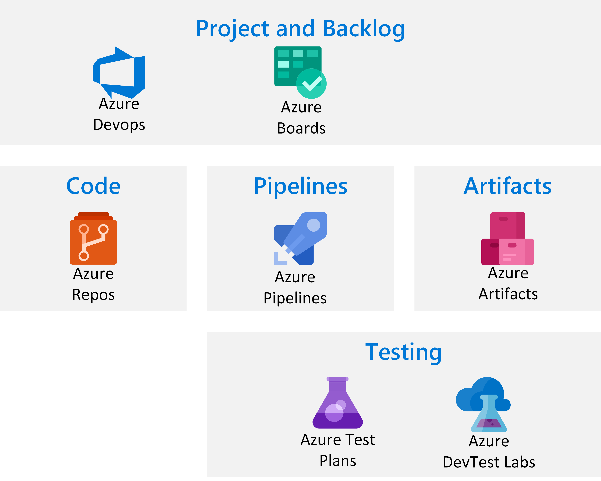

# Introduction

This guide aims to show effective ways of backing up and recovering a cloud native application, as well as how to recover in a regional outage or disaster recovery situation. Data loss prevention and business continuity can be extremely important once a data platform becomes line of business. Implementing this in a cost effective manner which will allow recovery with an impact appropriate to your business can be challenging. This guide will familiarise you with the concepts and trade offs and prepare you to design an effective solution.

## Cloud Applications

For the purposes of this guide, cloud applications will encompass any application using cloud based components, with the exception of pure IaaS solutions which are covered in a separate document. For each of the components in the solution, there will be an "infrastructure" perspective and an "application" perspective. Infrastructure in this context refers to the cloud components themselves, such as web platforms or a Logic App. Application will refer to the application logic which sits atop those cloud components. For your application, you will have deployment artifacts which may be code or compiled. For the purpose of this guide, we will discuss how to protect your code and artifacts as a single topic, and then refer to the deployment as generic artifacts for solution specific sections.

# Application

Your application is your intellectual property, and is where the value comes from in your application. As such it may be considered the most valuable asset aside from any data stored by the application.

## Code

## Pipelines

## Artifacts

## Projects and Backlogs

# Infrastructure

## Backup

### DevOps Deployment

## Disaster Recovery

# Azure Kubernetes Service (AKS)

# Web Service

# Function App

# Logic App